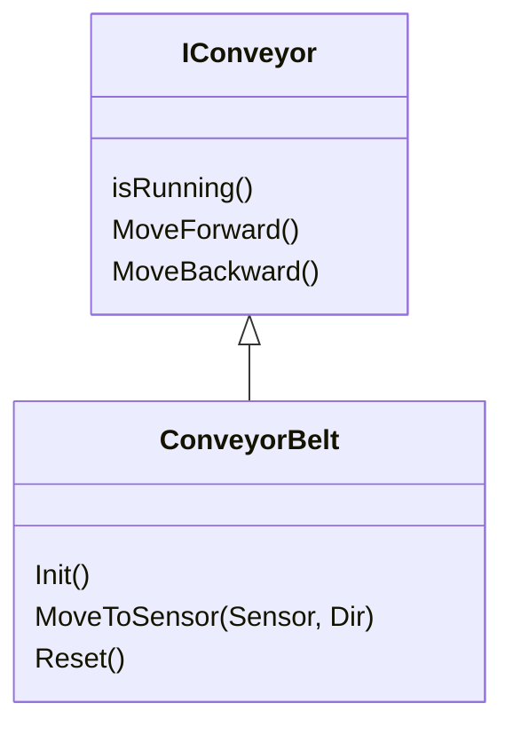

# Description for class "conveyorbelt"

## Namespace

```iec-st
Simatic.Ax.Mp
```

## Public members

|||
|-|-|
|value : DINT;| Value of this element
|key : STRING  := '';| Key of this element

## Methods

|||
|-|-|
|init() | Initialize the functionality|
|moveForward() | Let the conveyor move forward with a static velocity|
|moveToSensor(sensor, dir) | Specify the conveyor to move until a specific sensor is reached|
|moveBackward() | Let the conveyor move backward with a static velocity|

## Object


